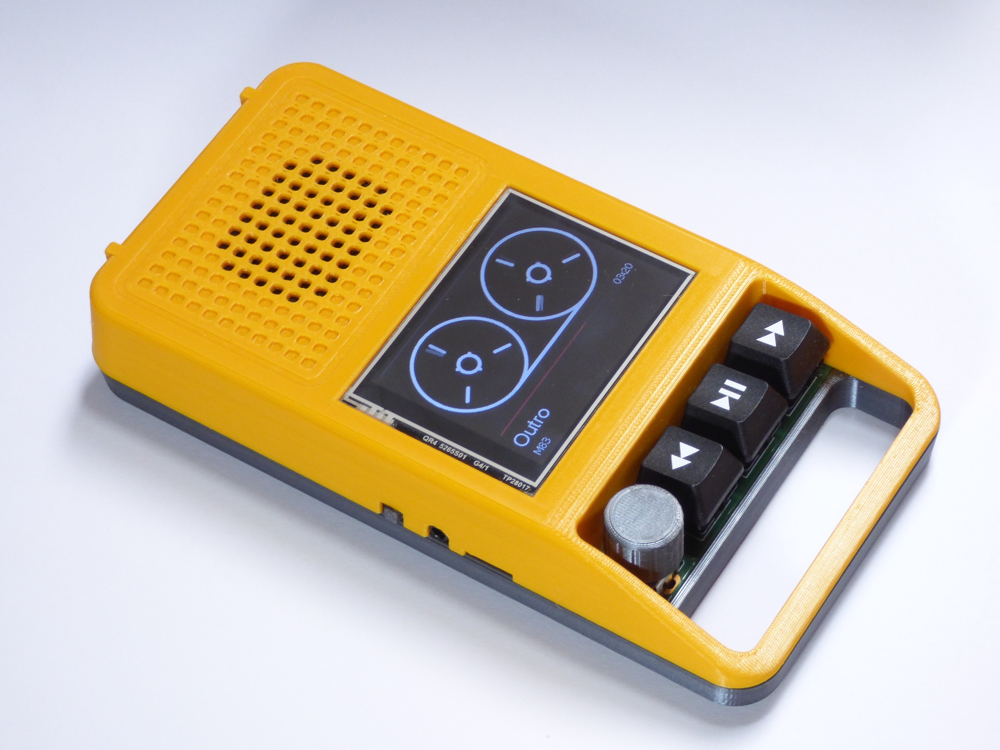

# DIY Retro Audio Player

Inspired by 1980s tape recorders, this audio player was designed with ease of use and accessibility in mind. Despite its nostalgic appearance, it packs modern hardware. Powered by the ESP32, it plays music and audiobooks from a micro SD card, either on its internal speaker or though a headphone jack. A 2.8“ IPS screen and mechanical buttons make up the simplistic user interface. The software is built around the ESP32-audioI2S library by GitHub user Schreibfaul1.

